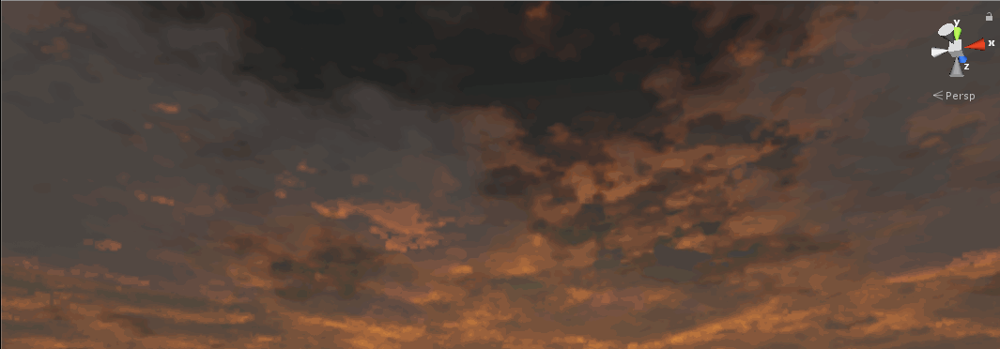
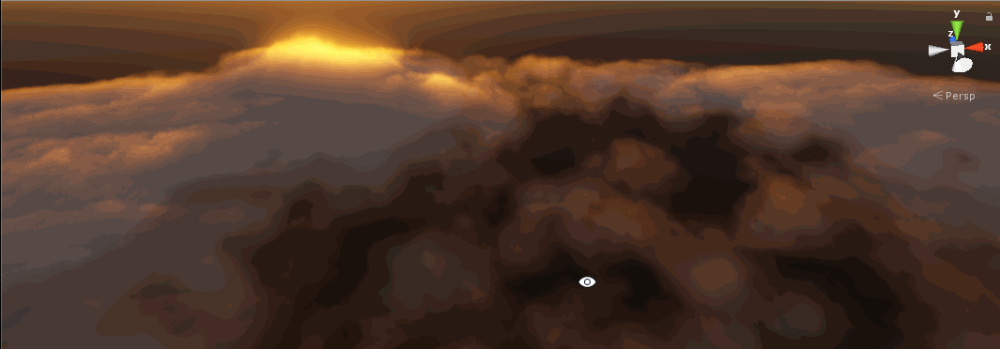

# Implementation Details  
This section describes some details about implementation. It's for developers who are also working on volume cloud. So some common topics won't be covered here. If you want to see the full pipeline, check the talks/articles in references.

## 4x4 or temporal
The major problem encountered during volume cloud rendering is performance. To obtain a nice-looking cloud, a really high sample count is required. Two methods are presented: Rendering each 4x4 cloud pixels in 16 frames, with high sample count(96)[1][2]. Or use a realtively low sample count(16 in frostbite) with full-resolution pass, combined with temporal reprojection to fix the looking.  
In the first version I implemented I chose to use the 4x4 way, but now I chose to use the frostbite's way for much cleaner code and easier to do more things(See improvements below).  

## Passes  
Three passes are required in my implementation.  
First pass renders an undersampled result for current frame. Second pass uses the result of first pass and history buffer to combine final result for this frame. Here the buffer stores sun intensity, estimated cloud depth and transmittance.  
Third pass does lighting using result of second pass, then blend with final image.  

## Raymarch Offset 
For each frame, raymarch rays are offset by a random value from halton sequence and a "bayer offset".  
The offset of halton sequence is generated in C# script, using code from Unity post-processing stack, and all rays share the same offset.  
By default, halton sequence alone is able to make temporal reprojection work. But bayer offset is required for later improvements.  
Bayer offset is based on bayer matrix. Every 3x3 pixel uses a 3x3 bayer matrix value to offset their rays.  
So the final offset of a ray is calculated by following code:  
```
static const float bayerOffsets[3][3] = {
	{0, 7, 3},
	{6, 5, 2},
	{4, 1, 8}
};
...
int2 texelID = int2(fmod(screenPos/ _TexelSize , 3.0));	//Calculate a texel id to index bayer matrix.						
float bayerOffset = (bayerOffsets[texelID.x][texelID.y]) / 9.0f;	//bayeroffset between[0,1)
float offset = -fmod(_RaymarchOffset + bayerOffset, 1.0f);			//final offset combined. The value will be multiplied by sample step in GetDensity.
```

## Temporal Reprojection  
During second pass, temporal reprojection is done.  
The vp matrix of previous frame is used to do reprojection for simplicity.  
A simple version for blend history buffer would be like: 
```
result = lerp(prevSample, raymarchResult, max(0.05f, outOfBound));
```
This works great if the camera could only rotate, and don't move at all. But the ghosting effects will appear once the camera starts to move in a large distance, just like regular TAA problems. Of course one could always fake the camera at (0,0,0) when rendering cloud, but that's not what I want.  
So I tried to use the fix in fixing TAA ghosting[5].  
```
float4 prevSample = tex2D(_MainTex, prevUV);
float2 xoffset = float2(_UndersampleCloudTex_TexelSize.x, 0.0f);
float2 yoffset = float2(0.0f, _UndersampleCloudTex_TexelSize.y);

float4 m1 = 0.0f, m2 = 0.0f;
//The loop below calculates mean and variance used to calculate AABB.
[unroll]
for (int x = -1; x <= 1; x ++) {
    [unroll]
    for (int y = -1; y <= 1; y ++ ) {
        float4 val;
        if (x == 0 && y == 0) {
            val = raymarchResult;
        }
        else {
            val = tex2Dlod(_UndersampleCloudTex, float4(i.uv + xoffset * x + yoffset * y, 0.0, 0.0));
        }
        m1 += val;
        m2 += val * val;
    }
}
//Code from https://zhuanlan.zhihu.com/p/64993622.
float gamma = 1.0f;
float4 mu = m1 / 9;
float4 sigma = sqrt(abs(m2 / 9 - mu * mu));
float4 minc = mu - gamma * sigma;
float4 maxc = mu + gamma * sigma;
prevSample = ClipAABB(minc, maxc, prevSample);	

//Blend.
raymarchResult = lerp(prevSample, raymarchResult, max(0.05f, outOfBound));
```

Though the buffer stores intensity, depth and transmittance, it turns out the those techniques just work with these "non-color" values. Except they don't work with the rest(assume we haven't added bayer offset)(see following gif).   
  
So, what happened here? It seems like we are back to the age without temporal reprojection and sample count is low.  
Briefly, the ClipAABB technique clip previous sample using a range built by surrounding pixels in current buffer.  But in our case, all surrounding pixels are undersampled result, and they share the same ray offset(before bayer offset is added), causing them easy to crash into a small area(Here the "area" is for the space built by intensity, depth and transmittance). Then this small area is used to clip history sample, making the history sample get clipped into this small area as well.  
So, bayer matrix comes to help. The idea is simple, we need the 9 samples in current frame to cover a larger area. By offset each ray in the 3x3 matrix, every ray is now intersecting with much different samples, and that makes a difference. (Below is the result)
  
And thanks to the really nice ClipAABB, moving the camera is not a trouble anymore, everything works like a charm.
  
(You can also see that view range is very limited above cloud, cause I limited max raymarch distance to avoid glitch of distance cloud. It's my next target to solve the range problem)

## Hierarchical-Height(Hi-height) Map  
Inspired by the technique Hi-Z screen space reflection, I've implemented a similar technique for fast-skipping empty space during raymarching, named hierarchical-heieght. 

There's a very easy-to-understand description about hi-z screen space reflection in the slider([Here](https://www.ea.com/frostbite/news/stochastic-screen-space-reflections)). After reading it, I realized that, I could make a texture same size as weather texture, but storing the most height cloud exists, by reading data in weather texture and density-height map. Then, during raymarching, I could quickly figure out whether current raypos exists any cloud, by looking up in the texture. Also, make a pyramid of this texture by using max operator on every four pixels, so I could use this pyramid texture to do some skipping, just like the way they use in hi-z ssr.

This requires the density-height texture not having some cloud type that forms a "hole" inside it, which is mostly true, if you want to simulate real-world cloud behaviour. But even breaking this limitation, this technique still helps fast-skipping in some degrees, so it doesn't really matter.

Compared to most common space-skipping technique in volume rendering, this one here uses the advantage of cloud rendering that obeys the assumption above. It only uses a 2D texture pyramid, rather than a huge 3D texture or some complex bvh buffer. Also the 2D texture could be evaluated at runtime with nearly no cost. 
