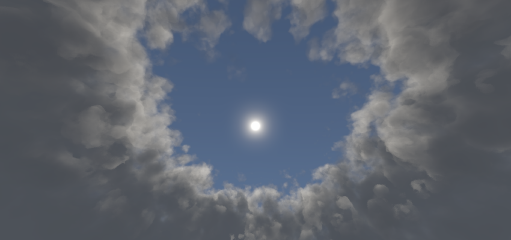
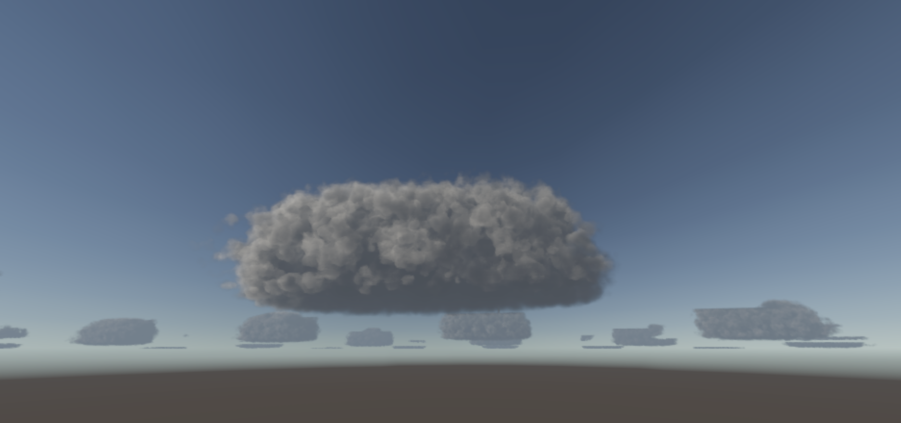
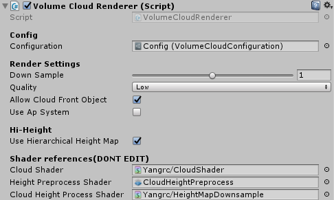
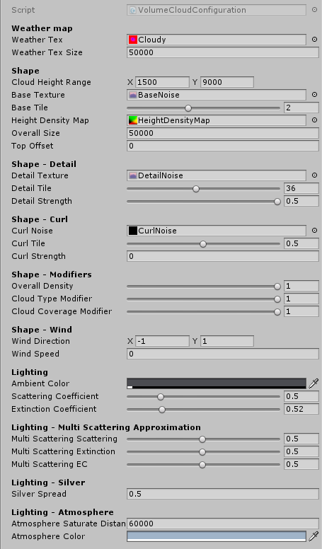
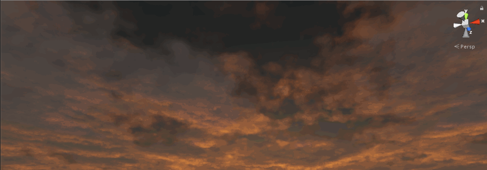

# Volume Cloud for Unity3D



**Volume Cloud for Unity3D** is a plugin for rendering cloud using raymarch. For now only compatible with standard rendering pipeline.  
The first screenshot is rendered in combination with my atmosphere scattering system([Here](https://github.com/yangrc1234/AtmosphereScatter))(The ap system is just my hobby project, not optimized at all. It's included in this repo, use it at your own risk).  
The second and third screenshot is rendered without any dependency.

# Quick startup
Clone the repo, find three screenshot scenes under folder in Assets/VolumeCloud/Example, and you should see the cloud right away.  

# Setup  
In this section you'll learn how to setup and adjust the shape and looking of the cloud.
## Camera Script 
1. Attach VolumeCloudRenderer to your camera. It's advised to put it before any post processing scripts. Once you add the script, the values in Inspector be filled with default values, and you should see effect right away.  
  
2. Adjust rendering settings. 
* The down sample option let cloud rendered into a low-resolution buffer, which greatly saves gpu performance. Setting to 1 means half the resolution, and 2 for quater.
* Quality option controls the sample count during raymarching. Lower quality only does half samples than high quality. Some noise pattern are visible when using low quality.
* Allow cloud front object. Turn on this option so that cloud could be rendered in front of object, but this brings a little artifact when object moves around. If you're sure your camera won't go into cloud, uncheck it.
* Use Ap system. Check this only when AtmosphereScatteringLutManager script in scene. (It will have impact on performance, since the atmosphere scattering system is not very optimized. I only used it for the screenshot.)  
The script has a config parameter. Create a new config by rightclick - Create - Volume Cloud Configuration. By default there's a config file under Assets\VolumeCloud\Example.  
There're many paramters you can tweak in the config file. Most of the params are intuitive enough to play with.
3. Adjust cloud properties in the config file. See below.

# Cloud Configuration
Most cloud properties are seprated from the script into the config asset for reuse.  
  
The default config in example should be nice enough to use. If you want do more control, continue reading. The most important options are listed below. Other options are not important or intuitive enough.  

## Weather map  
The weather Tex tells the renderer how does cloud formed over sky. It's most important if you want to adjust your sky.  
RGB channles are used, R channel for cloud coverage. G channel for wetness, and B for cloud type(see below).  
For now there isn't an automatic way to generate a weather map, just paint it yourself, or use those in example.  

## Height-Density Map(Idea from [4])
Height-density map describes the density of your cloud at specified height and type. X-axis for cloud type used in weather tex, Y-axis for height.  
On the R channel, density is set for corresponding cloud type and height.  
On the G channel, a detail value is set for corresponding cloud type and height. Higher the value, more "round" will the cloud be.  

## Shape / Shape-Detail / Shape-Curl
The basic idea of volume cloud rendering is raymarch though 3D cloud-like noise texture. Here two textures are used, naming base texture and detail texture.  
The cloud shape is formed from base texture, then subtracted by detail texture.  
Also, a curl noise is used to offset detail texture sampling, to provide a turbulence-like effect.  
Adjust corresponding settings will affect how sampling is done.  

## Shape Modifiers
These are global modifiers for some values. Just leave them for 1.

## Lighting  
The cloud lighting contains ambient light and directional light color contribution.  
Ambient color is directly added to final result no matter what.   
Scattering/Extinction coefficient are used to adjust how directional light affects cloud. Extinction describes how much cloud receives light, and scattering describes how much cloud scatters the light. Extinction value should never be greater than scattering value unless you want a non-physical effect(Or, the cloud in your game can glow).  
The multi-scattering section contains parameters for simulate multi-scattering effects. The idea is from [4]. Hover your mouse over the label for more info.  

## Lighting - Silver
This value controls how does the silver effect spread over cloud. Lower value causes silver effect more concentrated around sun and brighter.  

## Lighting - Atmosphere
Atmosphere saturate distance indicates how far will the cloud be invisible due to atmosphere. The cloud alpha value will begin to drop in distance, and finally become transparent in the distance set.  

## Wind  
Wind effect simulates the cloud moving by rotating the noise texture. So the overall cloud position won't be changed.  

# Misc

## Benchmark
Incoming.

## Known issues
Object edge glitch when allow cloud front is checked and downsampled, due to edge-preserving upsample is not implemented yet.

## TODO
- [x] Add aerial perspective things.  
- [ ] Extend view distance above cloud.
- [ ] HDRP integration?  
- [ ] Weather map generator.  
- [ ] Make the noise generator usable.  

## References
[1][The Real-time Volumetric Cloudscapes of Horizon: Zero Dawn](http://www.advances.realtimerendering.com/s2015/index.html)  
[2][Nubis: Authoring Real-Time Volumetric Cloudscapes with the Decima Engine](http://www.advances.realtimerendering.com/s2017/index.html)  
[3][TAA from playdead](https://github.com/playdeadgames/temporal)  
[4][Physically Based Sky, Atmosphere and Cloud Rendering in Frostbite](https://media.contentapi.ea.com/content/dam/eacom/frostbite/files/s2016-pbs-frostbite-sky-clouds-new.pdf)  
[5][Cool TAA history clip from zhihu](https://zhuanlan.zhihu.com/p/64993622)

## History.
18/4/15 - Fixed "band" glitch.  
18/7/7 - Added low-resolution rendering.    
18/10/28 - Added Height-Density map from [4]  
19/3/2 - Added depth estimation stuff, reduced blur problem when rotating camera.  
19/3/4 - Rewrite lighting code, using methods from [4], it should be very "physically based" now.  
19/5/18 - Rewrite raymarch and TAA. The 4x4 pattern is obsoleted. A full-screen raymarch with much lower sample count and temporal reprojection is used now.  

# Implementation Details  
This section describes some details about implementation. It's for developers who are also working on volume cloud. So some common topics won't be covered here. If you want to see the full pipeline, check the talks/articles in references.

## 4x4 or temporal
The major problem encountered during volume cloud rendering is performance. To obtain a nice-looking cloud, a really high sample count is required. Two methods are presented: Rendering each 4x4 cloud pixels in 16 frames, with high sample count(96)[1][2]. Or use a realtively low sample count(16 in frostbite) with full-resolution pass, combined with temporal reprojection to fix the looking.  
In the first version I implemented I chose to use the 4x4 way, but now I chose to use the frostbite's way for much cleaner code and easier to do more things(See improvements below).  

## Passes  
Three passes are required in my implementation.  
First pass renders an undersampled result for current frame. Second pass uses the result of first pass and history buffer to combine final result for this frame. Here the buffer stores sun intensity, estimated cloud depth and transmittance.  
Third pass does lighting using result of second pass, then blend with final image.  

## Raymarch Offset 
For each frame, raymarch rays are offset by a random value from halton sequence and a "bayer offset".  
The offset of halton sequence is generated in C# script, using code from Unity post-processing stack, and all rays share the same offset.  
By default, halton sequence alone is able to make temporal reprojection work. But bayer offset is required for later improvements.  
Bayer offset is based on bayer matrix. Every 3x3 pixel uses a 3x3 bayer matrix value to offset their rays.  
So the final offset of a ray is calculated by following code:  
```
static const float bayerOffsets[3][3] = {
	{0, 7, 3},
	{6, 5, 2},
	{4, 1, 8}
};
...
int2 texelID = int2(fmod(screenPos/ _TexelSize , 3.0));	//Calculate a texel id to index bayer matrix.						
float bayerOffset = (bayerOffsets[texelID.x][texelID.y]) / 9.0f;	//bayeroffset between[0,1)
float offset = -fmod(_RaymarchOffset + bayerOffset, 1.0f);			//final offset combined. The value will be multiplied by sample step in GetDensity.
```

## Temporal Reprojection  
During second pass, temporal reprojection is done.  
The vp matrix of previous frame is used to do reprojection for simplicity.  
A simple version for blend history buffer would be like: 
```
result = lerp(prevSample, raymarchResult, max(0.05f, outOfBound));
```
This works great if the camera could only rotate, and don't move at all. But the ghosting effects will appear once the camera starts to move in a large distance, just like regular TAA problems. Of course one could always fake the camera at (0,0,0) when rendering cloud, but that's not what I want.  
So I tried to use the fix in fixing TAA ghosting[5].  
```
float4 prevSample = tex2D(_MainTex, prevUV);
float2 xoffset = float2(_UndersampleCloudTex_TexelSize.x, 0.0f);
float2 yoffset = float2(0.0f, _UndersampleCloudTex_TexelSize.y);

float4 m1 = 0.0f, m2 = 0.0f;
//The loop below calculates mean and variance used to calculate AABB.
[unroll]
for (int x = -1; x <= 1; x ++) {
    [unroll]
    for (int y = -1; y <= 1; y ++ ) {
        float4 val;
        if (x == 0 && y == 0) {
            val = raymarchResult;
        }
        else {
            val = tex2Dlod(_UndersampleCloudTex, float4(i.uv + xoffset * x + yoffset * y, 0.0, 0.0));
        }
        m1 += val;
        m2 += val * val;
    }
}
//Code from https://zhuanlan.zhihu.com/p/64993622.
float gamma = 1.0f;
float4 mu = m1 / 9;
float4 sigma = sqrt(abs(m2 / 9 - mu * mu));
float4 minc = mu - gamma * sigma;
float4 maxc = mu + gamma * sigma;
prevSample = ClipAABB(minc, maxc, prevSample);	

//Blend.
raymarchResult = lerp(prevSample, raymarchResult, max(0.05f, outOfBound));
```

Though the buffer stores intensity, depth and transmittance, it turns out the those techniques just work with these "non-color" values. Except they don't work with the rest(assume we haven't added bayer offset)(see following gif).   
  
So, what happened here? It seems like we are back to the age without temporal reprojection and sample count is low.  
Briefly, the ClipAABB technique clip previous sample using a range built by surrounding pixels in current buffer.  But in our case, all surrounding pixels are undersampled result, and they share the same ray offset(before bayer offset is added), causing them easy to crash into a small area(Here the "area" is for the space built by intensity, depth and transmittance). Then this small area is used to clip history sample, making the history sample get clipped into this small area as well.  
So, bayer matrix comes to help. The idea is simple, we need the 9 samples in current frame to cover a larger area. By offset each ray in the 3x3 matrix, every ray is now intersecting with much different samples, and that makes a difference. (Below is the result)
  
And thanks to the really nice ClipAABB, moving the camera is not a trouble anymore, everything works like a charm.
  
(You can also see that view range is very limited above cloud, cause I limited max raymarch distance to avoid glitch of distance cloud. It's my next target to solve the range problem)
