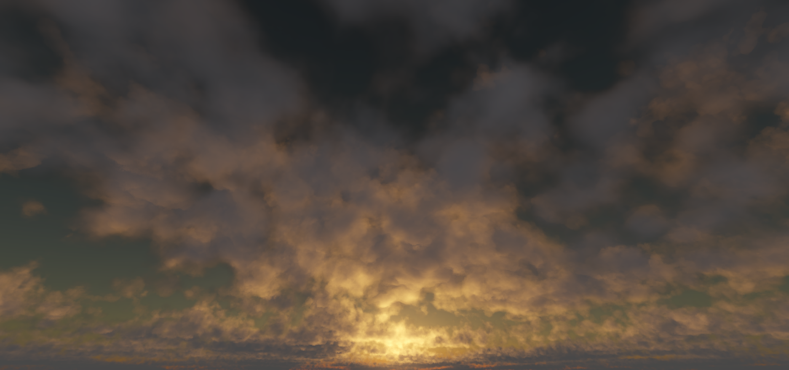

# Volume Cloud for Unity3D
This is an volume cloud rendering implementation for Unity3D using methods from Horizon:Zero Dawn.

## Settings
This is a post-process effect. You need to add the script VolumeCloud to camera.  
A configuration file is required, so you can share same configuration between multiple cameras. Right-click in project window to generate one.  
Some values can only be edited in the shader file CloudShaderHelper.cginc. e.g. sample step count, cloud layer position, thickness and earth radius(for correct atmosphere shape).
A Weather tex is required to make cloud only cover part of sky. A very simple example is included in Textures/. A better idea is to make textures on demand, or write a shader that renders a weather texture.  
The weather tex uses 3 channals, R for coverage, G for density, B for cloud type. low coverage makes fewer clouds. lower density however won't change the count or size of shape, but affects the lighting of the cloud, it's reconmmended to use higher density for rain cloud(make it look darker). Larger cloud type value makes taller cloud shape.  

## Implementation details.
Most of the techniques are the same from the slides.  
1. The rendering is a post-processing effect.  
2. First a quarter-res buffer is rendered which is the main part, including building the cloud shape and sample for light etc.(The result contains intensity, density and depth).  
3. A history buffer is maintained, by blending history buffer(reprojected so to sample correctly) and the quarter-res buffer together to make new one.(quarter-res buffer is firstly shaded then blended with history buffer.)  
4. Blit the cloud image with final image.  

## Known issues 
Rendering is weird when above cloud layer.  

## TODO
Add low-resolution render
Add correct atmosphere scattering

## References
[The Real-time Volumetric Cloudscapes of Horizon: Zero Dawn](http://www.advances.realtimerendering.com/s2015/index.html)  
[Nubis: Authoring Real-Time Volumetric Cloudscapes with the Decima Engine](http://www.advances.realtimerendering.com/s2017/index.html)  
[TAA from playdead for reprojection](https://github.com/playdeadgames/temporal)  

## History.
18/4/15 - Fixed "band" glitch.